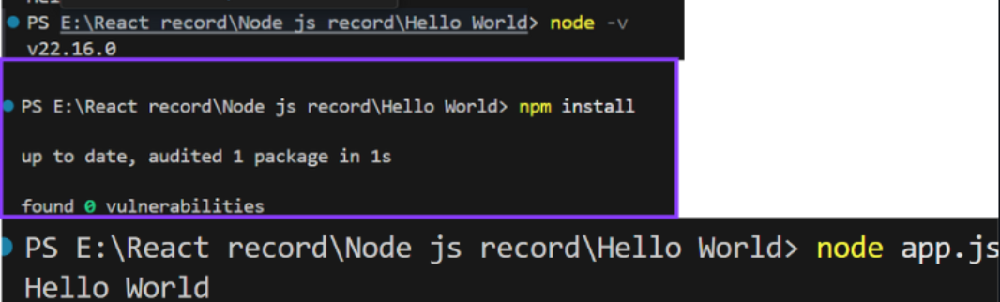

# Experiment 1: Node.js Hello World

**Course Outcome (CO1):** Understand how to install Node.js and npm, and create a basic Node.js script.

---

## Objective

- Install Node.js and npm on your system.
- Create a simple Node.js script that prints `"Hello World"` to the console.

---

## Prerequisites

- A computer with internet access.
- Terminal / Command Prompt / VS Code or any code editor.

---
## Screenshots

Here’s a preview of the app:



## Step 1: Install Node.js and npm

1. Go to the [Node.js official website](https://nodejs.org/).
2. Download the **LTS (Long Term Support)** version.
3. Run the installer and follow the instructions:
   - Accept license agreement.
   - Keep default installation path.
   - Make sure **“Add to PATH”** is checked.
4. Verify installation by running in terminal:

```bash
node -v
npm -v
npm init -y
npm install
node server.js or npm run dev (if you have nodemon)
